<!--
"window.zoomLevel": 0.9,// & 1.9
"workbench.colorTheme": "Prism",
-->

#### Real talk: this is one of the most annoying extensions out there. Unless you are learning to code, I recommend keeping the inline message disabled by default and binding a hotkey to toggle it:

```js
// keybindings.json
{
	"key": "ctrl+u",
	"command": "errorLens.toggleInlineMessage",
    //          ^ Toggles global setting `errorLens.messageEnabled`
},
```

#### If you don't want to go with the hotkey route - it's possible to:

1) Exclude problems (in workspace, by source, by code, by message)
1) Show fewer decorations (render decoration only on the active line)
1) Delay showing decorations (delay ms / on document save)
1) Transform problem message (make it shorter maybe)
1) Other settings to make it less distracting

### 1. Exclude problems:

```js
"errorLens.exclude": [
	"Missing semicolon",
	"Newline required at end of file but not found",
	"More than 1 blank line not allowed",
],
// OR
"errorLens.excludeBySource": [
    "eslint(padded-blocks)",
],
```

### 2. Show only active line decoration or closest problem:

```js
"errorLens.followCursor": "activeLine",
// OR
"errorLens.followCursor": "closestProblem",
```

### 3. Delay showing problems:

```js
"errorLens.delay": 1500,
// OR
"errorLens.onSave": true,
```

### 4. Transform problem message:

<table>
<tbody>
<tr>
<td>

```js
"errorLens.replace": [
	{
		"matcher": "is declared but its value is never read",
		"message": "ಠ╭╮ಠ",
	},
],
```

</td>
<td>


</td>
</tr>
</tbody>
</table>

---

## Settings (70+)

### `errorLens.enabled`

Toggle all decorations and features (background highlighting, inline message, gutter icons, status bar message, code lens).
Extension adds a command to toggle this setting: `errorLens.toggle` **Error Lens: Toggle (Enable/Disable) Everything**

### `errorLens.respectUpstreamEnabled`

Disable decorations or features when VSCode setting `problems.visibility` ("Controls whether the problems are visible throughout the editor and workbench") is disabled.

### `errorLens.enabledInMergeConflict`

Disable decorations when file has merge conflict symbols `<<<<<<<` or `=======` or `>>>>>>>`.

### `errorLens.fontFamily`

Change font family of inline message. Not supported natively by VSCode. Non-monospace fonts can usually fit more characters in the same space.

### `errorLens.fontWeight`

Whether to use bold or not font weight for messages.

<table>
<tbody>
<tr>
<th align="center">"normal"</th>
<th align="center">"bold"</th>
</tr>
<tr>
<td>

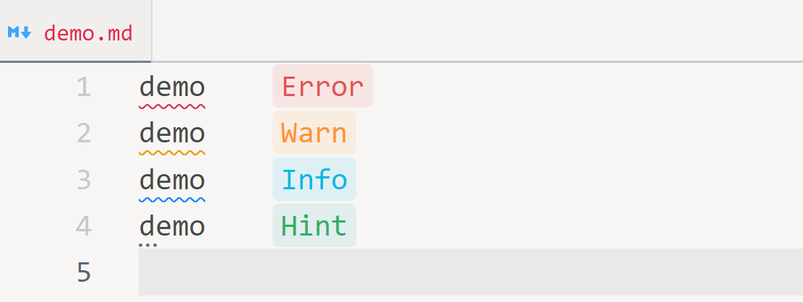

</td>

<td>


</td>

</tr>
</tbody>
</table>

### `errorLens.fontStyleItalic`

Whether to use italic font style or not for messages.

<table>
<thead>
<tr>
<th align="center">false</th>
<th align="center">true</th>
</tr>
</thead>
<tbody>
<tr>
<td>

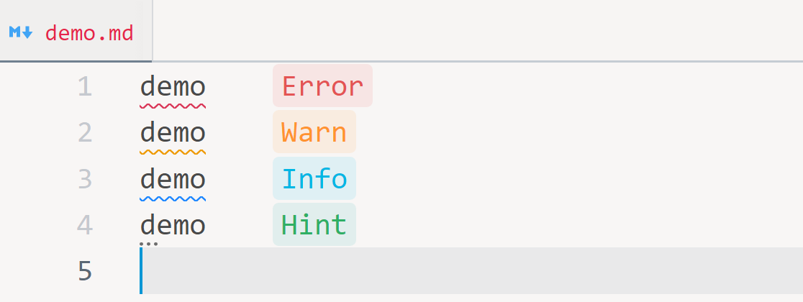

</td>

<td>

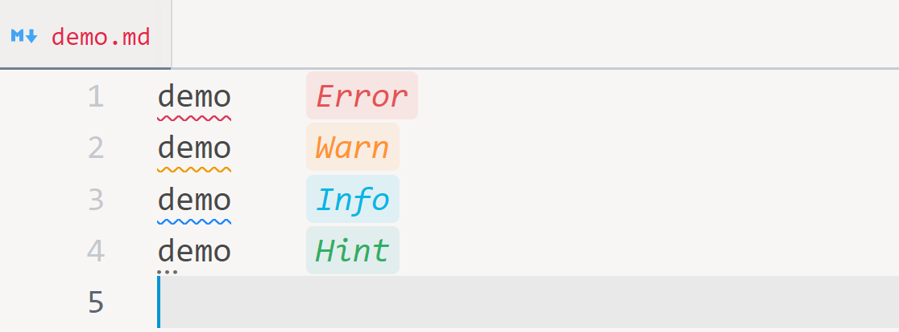

</td>

</tr>
</tbody>
</table>

### `errorLens.fontSize`

Change font size of inline message. Not supported natively by VSCode. Mostly useful to make message smaller, not bigger.

<table>
<tbody>

<tr>
<th>""</th>
<td>


</td>
</tr>

<tr>
<th>"12px"</th>
<td>


</td>
</tr>

</tbody>
</table>


### `errorLens.margin`

Extra space between the end of the line (end of text) and the inline message.

<table>
<thead>
<tr>
<th align="center">"4ch"</th>
<th align="center">"0"</th>
<th align="center">"100px"</th>
</tr>
</thead>
<tbody>
<tr>
<td>


</td>

<td>


</td>

<td>

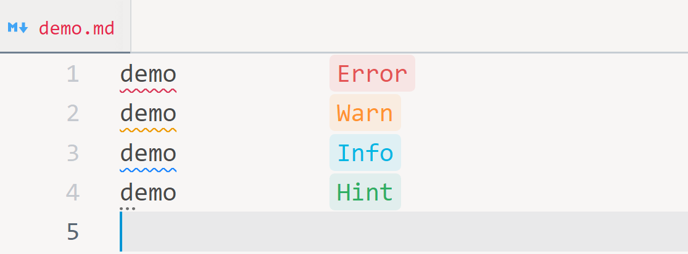

</td>

</tr>
</tbody>
</table>

### `errorLens.alignMessage`

Align message to be in the same column (if possible). Only works with monospace fonts.

<table>
<thead>
<tr>
<th align="center"></th>
<th align="center"></th>
</tr>
</thead>
<tbody>

<tr>
<td>

```js
"errorLens.alignMessage": {
	"start": 40,
	"end": 0,
	"padding": [0, 0.5],
},
```

</td>
<td>


</td>
</tr>

<tr>
<td>

```js
"errorLens.alignMessage": {
	"start": 0,
	"end": 80,
	"padding": [0, 0.5],
},
```

</td>
<td>


</td>
</tr>

</tbody>
</table>

### `errorLens.padding`

Add space around the inline message. Only visible when [errorLens.messageBackgroundMode](#errorlensmessagebackgroundmode) is set to `message`.

### `errorLens.borderRadius`

Round corners for inline message. Only visible when [errorLens.messageBackgroundMode](#errorlensmessagebackgroundmode) is set to `message`.

<table>
<thead>
<tr>
<th align="center">"0.3em"</th>
<th align="center">"0"</th>
<th align="center">"50%"</th>
<th align="center">"10px 30px 10px 30px"</th>
</tr>
</thead>
<tbody>
<tr>
<td>

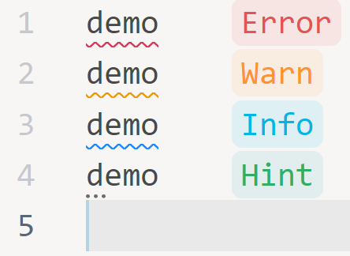

</td>

<td>

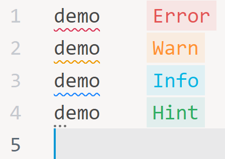

</td>

<td>

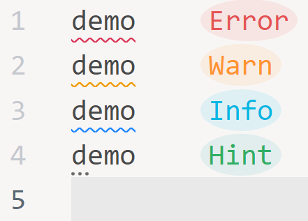

</td>

<td>

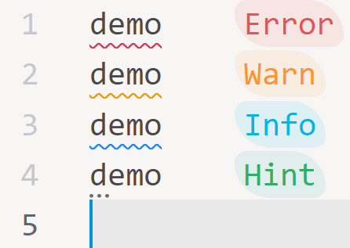

</td>

</tr>
</tbody>
</table>

### `errorLens.enabledDiagnosticLevels`

Controls which diagnostics to include (error/warning/info/hint) for all features of this extension (decorations, gutter, status bar, code lens,...).

<table>
<thead>
<tr>
<th align="center">["error", "warning", "info", "hint"]</th>
<th align="center">["error", "warning"]</th>
<th align="center">["error", "info"]</th>
</tr>
</thead>
<tbody>
<tr>
<td>


</td>

<td>

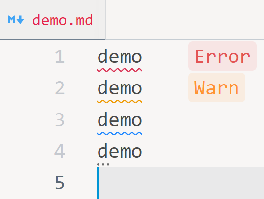

</td>

<td>

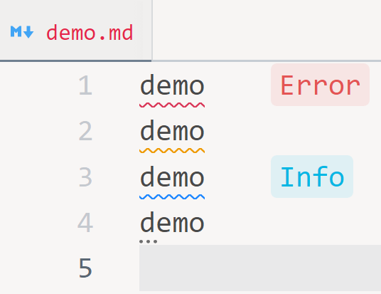

</td>

</tr>
</tbody>
</table>

### `errorLens.messageTemplate`

Template used for all inline messages. Possible variables:

- `$message` - diagnostic message text
- `$count` - Number of diagnostics on the line
- `$severity` - Severity prefix taken from `#errorLens.severityText#`
- `$source` - Source of diagnostic e.g. \"eslint\"
- `$code` - Code of the diagnostic

### `errorLens.messageMaxChars`

Truncate inline message.

### `errorLens.severityText`

Replaces `$severity` variable in [errorLens.messageTemplate](#errorlensmessagetemplate).

### `errorLens.messageEnabled`

Controls visibility of inline message (including background highlighting). Doesn't include gutter icons.

### `errorLens.messageBackgroundMode`

- `"line"` - Highlights the entire line.
- `"message"` - Shows inline message without highlighting the entire line.
- `"none"` - Shows inline message but without background highlighting

### `errorLens.problemRangeDecorationEnabled`

Highlight problem locations.
<!-- TODO: advanced examples combined with `errorLens.decorations` -->
<!-- TODO: example of disabling native VSCode squigglies -->
<!-- TODO: VSCode has its own highlighting like `editorError.background` -->

### `errorLens.editorHoverPartsEnabled`

Controls which parts of hover are enabled (for the text editor; Doesn't affect status bar message hover).

- `messageEnabled` - Shows problem message.
- `sourceCodeEnabled` Shows prblem `source` & `code` and buttons to copy them to the clipboard
- `buttonsEnabled` - Show buttons like `Exclude`, `Open Definition`, `Search`...

### `errorLens.statusBarIconsEnabled`

Show icons for Errors & Warnings in status bar similar to native ones, but with the ability to change color / background color.

### `errorLens.statusBarIconsPriority`

Move status bar icons right/left.

### `errorLens.statusBarIconsAlignment`

Choose alignment of the status bar icons left/right side of the viewport.

### `errorLens.statusBarIconsTargetProblems`

Choose what to include in counters for problems (status bar icons).

### `errorLens.statusBarIconsUseBackground`

When enabled - highlight status bar with background colors. Only 2 VSCode colors allowed (`statusBarItem.errorBackground` & `statusBarItem.warningBackground`).

### `errorLens.statusBarIconsAtZero`

Choose what happens to status bar icons when there are no errors - hide or remove background color.

### `errorLens.statusBarMessageEnabled`

Show problem message in Status Bar.

### `errorLens.statusBarMessageType`

Choose which diagnostic to use for status bar message:

- `closestProblem`
- `closestSeverity`
- `activeLine`
- `activeCursor`

### `errorLens.statusBarMessagePriority`

Move status bar icons right/left.

### `errorLens.statusBarMessageAlignment`

Choose alignment of the status bar message left/right side of the viewport.

### `errorLens.statusBarColorsEnabled`

### `errorLens.statusBarCommand`
<!-- TODO: maybe this should be `errorLens.statusBarMessageCommand` -->

### `errorLens.statusBarMessageTemplate`

Almost the same as [errorLens.messageTemplate](#errorlensmessagetemplate) but instead affects status bar message.

### `errorLens.replace`

Replace message with custom one. Uses strings to create RegExp with `iu` flags.

### `errorLens.exclude`

Exclude diagnostics by message. Uses strings to create RegExp with `iu` flags.

### `errorLens.excludeBySource`

Exclude diagnostics by source or source+code pair.

### `errorLens.excludePatterns`

Exclude files by using [glob](https://code.visualstudio.com/docs/editor/glob-patterns) pattern (VSCode flavor. May have differences like [Glob matching should be case insensitive Issue#10633](https://github.com/Microsoft/vscode/issues/10633)). Example `[\"**/*.{ts,js}\"]`.

### `errorLens.excludeWorkspaces`

Exclude the entire workspace from highlighting problems. Related Command: `errorlens.toggleWorkspace` .

### `errorLens.disableLineComments`

Used for `errorLens.disableLine` command that adds a comment disabling linter rule for a line.

To force comment on the same line - add `SAME_LINE` to the message: `"eslint": "// eslint-disable-line $code SAME_LINE"`

### `errorLens.lintFilePaths`

### `errorLens.searchForProblemQuery`

### `errorLens.selectProblemType`

### `errorLens.light`

Override colors when on of the "light" themes is used. Only for colors that are specified in "settings", not in "colors".

### `errorLens.delay`

Wait this amount (in milliseconds) before showing decorations.

### `errorLens.delayMode`

- `new` - Old/stale problems should disappear immediately while new problems should respect [errorLens.delay](#errorlensdelay)
- `old` - Buggy/Overcomplicated old implementation
- `debounce` - Simply use `debounce()` from `Lodash` library. Old/stale problems also wait [errorLens.delay](#errorlensdelay)

### `errorLens.onSave`

### `errorLens.onSaveTimeout`

### `errorLens.onSaveUpdateOnActiveEditorChange`

### `errorLens.enableOnDiffView`

### `errorLens.followCursor`

### `errorLens.followCursorMore`

### `errorLens.multilineMessage`

EXPERIMENTAL. Very far away to being done. There's no api to implement this properly.

### `errorLens.gutterIconsEnabled`

Whether to show gutter icons or not.

<table>
<tbody>
<tr>
<th align="center">false</th>
<th align="center">true</th>
</tr>
<tr>
<td>

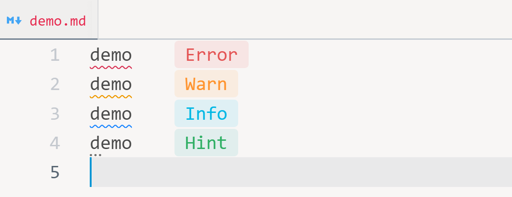

</td>

<td>

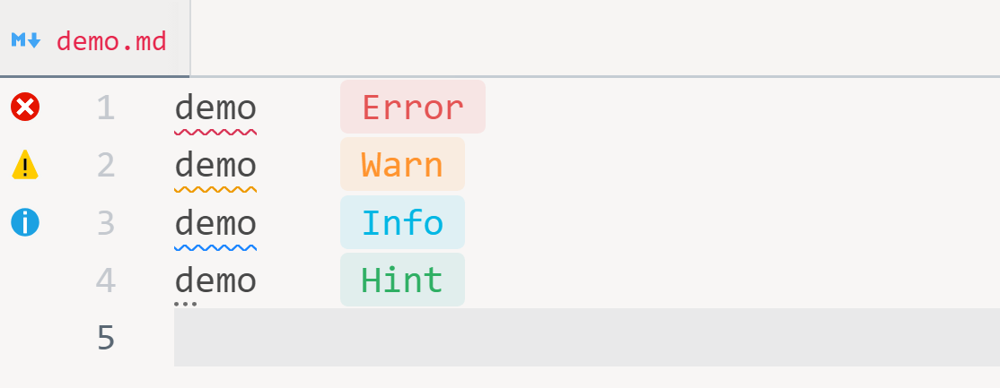

</td>

</tr>
</tbody>
</table>

### `errorLens.gutterIconsFollowCursorOverride`

When enabled and [errorLens.followCursor](#errorlensfollowcursor) setting is not set to `allLines`, then gutter icons would be rendered for all problems. This setting can overcome that:

<table>
<tbody>

<tr>
<td>

```js
"errorLens.gutterIconsEnabled": true,
"errorLens.followCursor": "activeLine",
"errorLens.gutterIconsFollowCursorOverride": true,
```

</td>
<td>

```js
"errorLens.gutterIconsEnabled": true,
"errorLens.followCursor": "activeLine",
"errorLens.gutterIconsFollowCursorOverride": false,
```

</td>
</tr>

<tr>
<td>


</td>

<td>


</td>

</tr>
</tbody>
</table>

### `errorLens.gutterIconSize`

Change size of gutter icons:

<table>
<thead>
<tr>
<th align="center">"100%"</th>
<th align="center">"70%"</th>
<th align="center">"150%"</th>
</tr>
</thead>
<tbody>
<tr>
<td>

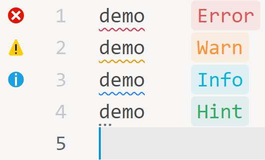

</td>

<td>


</td>

<td>


</td>

</tr>
</tbody>
</table>

### `errorLens.gutterIconSet`

<table>
<tbody>

<tr>
<th>"default"</th>
<th>"circle"</th>
</tr>

<tr>
<td>

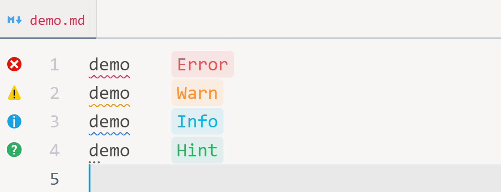

</td>

<td>


</td>
</tr>

<tr>
<th>"squareRounded"</th>
<th>"letter"</th>
</tr>

<tr>
<td>

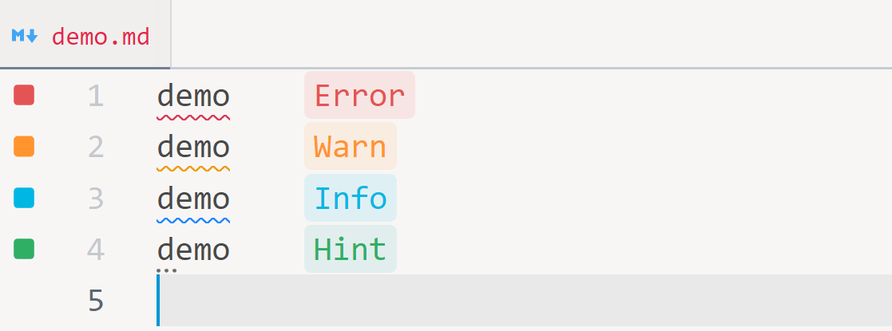

</td>

<td>

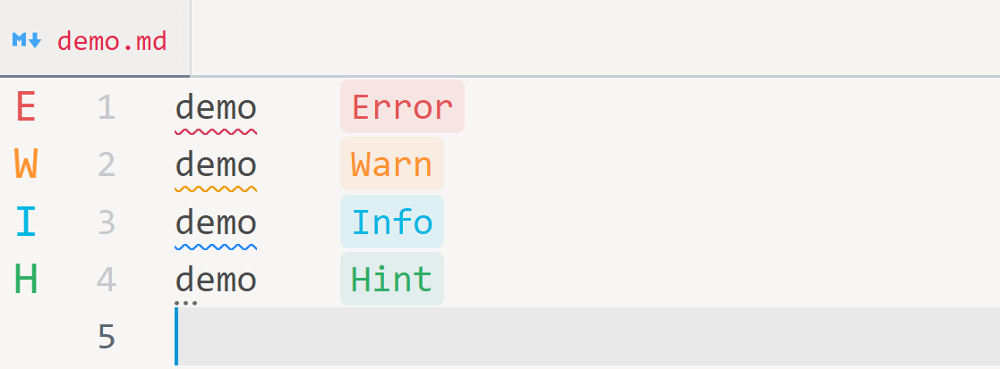

</td>
</tr>

<tr>
<th>"emoji"</th>
<th></th>
</tr>

<tr>
<td>

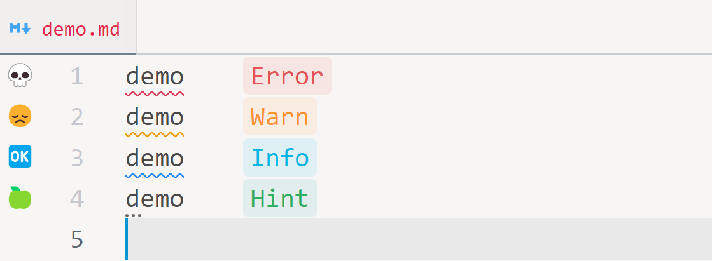

</td>

<td>

</td>
</tr>

</tbody>
</table>

### `errorLens.gutterEmoji`

Control image shown in gutter when [errorLens.gutterIconSet](#errorlensguttericonset) is `"emoji"`. Can use other utf-8 symbols like ♞/⚃/⛆/★/▣/◈/... Possible to fit 2 symbols that are not as wide as emoji.

<table>
<tbody>
<tr>
<td>

```js
"errorLens.gutterEmoji": {
	"error": "🍎",
	"warning": "🍊",
	"info": "⟁",
	"hint": ":(",
},
```

</td>

<td>


</td>

</tr>
</tbody>
</table>

### `errorLens.errorGutterIconPath`

### `errorLens.warningGutterIconPath`

### `errorLens.infoGutterIconPath`

### `errorLens.hintGutterIconPath`

### `errorLens.errorGutterIconColor`

### `errorLens.warningGutterIconColor`

### `errorLens.infoGutterIconColor`

### `errorLens.hintGutterIconColor`

### `errorLens.removeLinebreaks`

Diagnostic message may contain linebreaks, but inline message decorations are ... inline. This replaces linebreaks (multiple in a row too) with the symbol controlled by [errorLens.replaceLinebreaksSymbol](#errorlensreplacelinebreakssymbol).

### `errorLens.replaceLinebreaksSymbol`

When [errorLens.removeLinebreaks](#errorlensremovelinebreaks) is enabled => replaced linebreaks `\n` with the new symbol that can be represented inline (`⏎` by default).

### `errorLens.scrollbarHackEnabled`

When showing inline message decorations - VSCode also shows horizontal scrollbar that stays even after message is removed. This is a hack that makes inline message to be absolutely positioned `position:absolute;` to not show any scrollbars. It can make the [errorLens.padding](#errorlenspadding) look differently.

### `errorLens.decorations`

Advanced control over decorations.

### `errorLens.ignoreUntitled`

When enabled - will not show any decorations in files with the file scheme `untitled` (newly created unsaved files).

### `errorLens.ignoreDirty`

When enabled - will not show any decorations on Dirty (modified) files.

### `errorLens.codeLensEnabled`

Show messages as insets between the lines. ...

### `errorLens.codeLensLength`

Enforce minimum and maximum length of cole lens messages.

### `errorLens.codeLensTemplate`

Almost the same as [errorLens.messageTemplate](#errorlensmessagetemplate), but for the Code Lens feature.

### `errorLens.codeLensOnClick`

Code Lens is clickable. This setting configures what happens when you click on Code Lens message:

- `none` => does nothing
- `showProblemsView` => Open VSCode built-in `Problems` view (runs `workbench.actions.view.problems`)
- `showQuickFix` => Open Quick Fix menu (runs `editor.action.quickFix`)
- `searchForProblem` => Search for problem message in your default browser (runs `errorLens.searchForProblem`)
